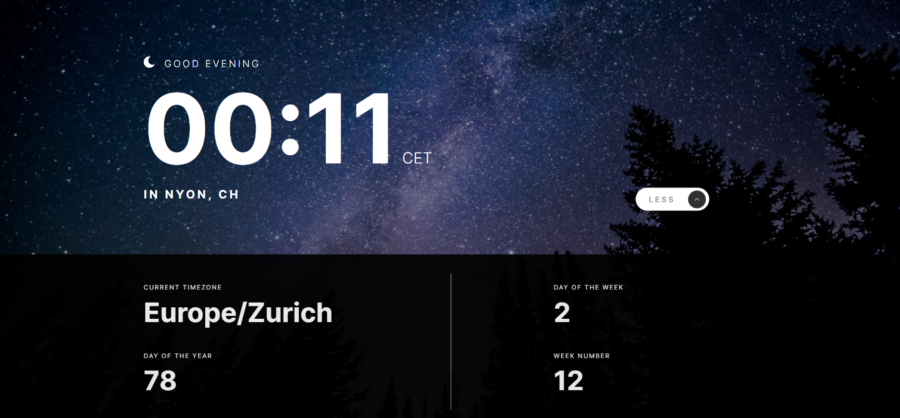

# Frontend Mentor - Clock app solution

This is a solution to the [Clock app challenge on Frontend Mentor](https://www.frontendmentor.io/challenges/clock-app-LMFaxFwrM). Frontend Mentor challenges help you improve your coding skills by building realistic projects.

## Overview

### The challenge

Users should be able to:

- View the optimal layout for the site depending on their device's screen size
- See hover states for all interactive elements on the page
- View the current time and location information based on their IP address
- View additional information about the date and time in the expanded state
- Be shown the correct greeting and background image based on the time of day they're visiting the site
- Generate random programming quotes by clicking the refresh icon near the quote

### Screenshot

### Links

- Solution URL: [https://www.frontendmentor.io/solutions/clock-with-real-time-data-uCNjB0Luyt]([https://your-solution-url.com](https://www.frontendmentor.io/solutions/clock-with-real-time-data-uCNjB0Luyt))
- Live Site URL: [https://localclockpoc.netlify.app/](https://localclockpoc.netlify.app/)

### Built with

- HTML5
- [React](https://reactjs.org/) - JS library
- [tailwindcss](https://tailwindcss.com/) - For styles
- Rest APIs
    - [Get localization information](https://api.techniknews.net/)
    - [Determine sunset from the location](https://api.sunrise-sunset.org)
